# Docker Swarm

In this section, we take a big leap by exploring **Container Orchestration**. While Kubernetes is the most popular solution (which we'll cover later), we'll focus first on **Docker Swarm**, which is native to Docker and simpler to start with.

## What is Container Orchestration?

Container orchestration is the automated management of containerized applications, including deployment, scaling, networking, and lifecycle operations. Tools like Docker Swarm or Kubernetes handle how and where containers run across a cluster of machines. This ensures apps remain available and efficient with minimal manual effort.

### 🧍 In Layman's Terms:

Imagine you run a food truck business with many chefs (containers). Container orchestration is like a smart manager who assigns chefs to the right kitchens (servers), keeps everything running, and ensures there's always food ready—even during a rush. 🍔🚚

## Architecture Overview

We're using **Google Cloud Platform (GCP)** to build our Docker Swarm cluster. A Load Balancer is placed in front of the cluster to simulate a production-like setup.

### 🏗️ Components:

- 1 Load Balancer  
- 1 Manager Node  
- 2 Worker Nodes  

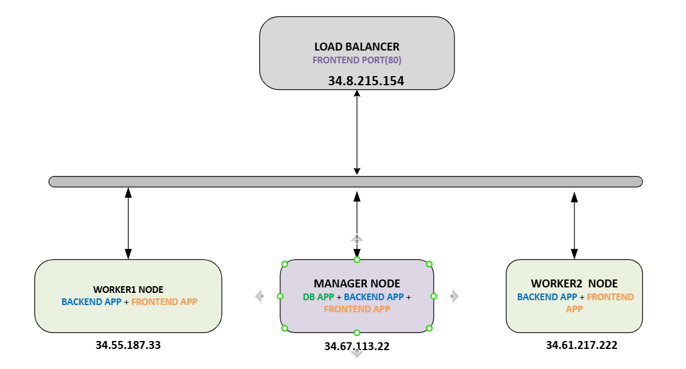

## Docker Swarm Components

| Component       | Description                                                                 |
|----------------|-----------------------------------------------------------------------------|
| **Manager Node** | Controls the swarm, handles orchestration, scheduling, and cluster state. |
| **Worker Node**  | Runs application containers as instructed by the manager.                  |
| **Service**      | A task definition (like a container blueprint) including image, ports, and replicas. |
| **Task**         | A single running container instance that is part of a service.             |
| **Overlay Network** | A virtual network that allows containers across nodes to communicate securely. |
| **Swarm**        | The cluster of Docker engines (nodes) working together.                   |

## Prerequisites

1. Create a [Docker Hub](https://hub.docker.com/) account — we’ll use it to store our container images.

## 🚀 Create 3 Ubuntu 24.04 LTS Instances on GCP

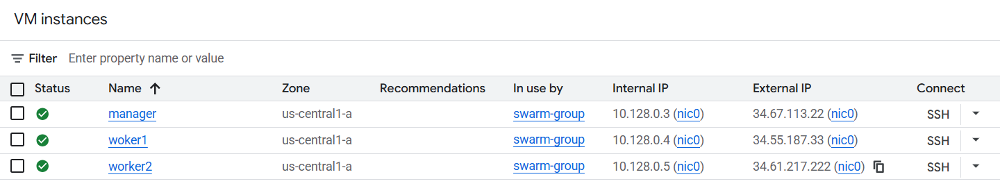

Create an instance group named **swarm-group** and add the 3 instances to it.

## 🔧 Docker Swarm Setup

1. **Install Docker** on all nodes (manager, worker1, worker2):  
   ➡️ [Install Docker on Ubuntu](https://docs.docker.com/engine/install/ubuntu/)

2. **Initialize Docker Swarm on the Manager Node**:

```bash
docker swarm init
```

You can check the swarm status with:

```bash
docker info | grep Swarm
# Output: Swarm: active
```

3. **Join Worker Nodes**

After running `docker swarm init`, you'll get a join token. If you missed it:

```bash
docker swarm join-token worker
```

Use the provided command on `worker1` and `worker2`, e.g.:

```bash
docker swarm join --token <token> <manager-ip>:2377
```

4. **Verify Cluster**

```bash
docker node ls
```

Expected output:
```
ID                            HOSTNAME   STATUS    AVAILABILITY   MANAGER STATUS   ENGINE VERSION
manager-randomid          *   manager    Ready     Active         Leader           28.2.2
worker1-randomid              worker1    Ready     Active                          28.2.2
worker2-randomid              worker2    Ready     Active                          28.2.2
```

## 📦 Deployments

> ⚠️ All deployment commands are run on the **Manager Node**.

### 🔹 Part One — Deploy Services Using the CLI

1. **Clone the Project Repository**
```bash
git clone https://github.com/robudex17/sbtph_leaderboard.git
```
2. After cloning, navigate into the project directory:

```bash
   cd sbtph_leaderboard
```
📁 This is the root directory of the project where all required folders and files are located.


3. **Label the Manager Node**  
This ensures the database is only scheduled on the manager, where volume binding is configured.
```bash
docker node update --label-add database=yes manager
```

4. **Create Volume Directory for MariaDB**
```bash
mkdir /root/mariadb
```

5. **Deploy the MariaDB Service**
```bash
docker service create   --name leaderboard-db   --network leaderboard-net   --replicas 1   --mount type=bind,src=/root/mariadb,dst=/var/lib/mysql   --mount type=bind,src=/root/sbtph_leaderboard/database,dst=/docker-entrypoint-initdb.d   --env MARIADB_ROOT_PASSWORD=<MARIADB_ROOT_PASSWORD>   --env MARIADB_USER=<MARIADB_USER>   --env MARIADB_PASSWORD=<MARIADB_PASSWORD>   --env MARIADB_DATABASE=leaderboard   --publish published=3306,target=3306,mode=ingress   --constraint 'node.labels.database == yes'   mariadb:latest
```

6. **Build Backend Image**
```bash
cd backend
docker build -t <REPLACE-WITH-YOUR-DOCKERHUB-USERNAME>/leaderboard-backend .
cd ..
```

7. **Push Backend Image to Docker Hub**
```bash
docker login
docker push <REPLACE-WITH-YOUR-DOCKERHUB-USERNAME>/leaderboard-backend
```

8. **Deploy the Backend Service**
```bash
docker service create   --name leaderboard-backend   --network leaderboard-net   --replicas 3   --publish published=8080,target=8080,mode=ingress   --env DB_USER=<MARIADB_USER>   --env DB_PASSWORD=<MARIADB_PASSWORD>   --env DB_NAME=leaderboard   --env DB_HOST=leaderboard-db   --env JWT_SECRET=<JWT_SECRET>   --env JWT_REFRESH_SECRET=<JWT_REFRESH_SECRET>   --env PORT=8080   <REPLACE-WITH-YOUR-DOCKERHUB-USERNAME>/leaderboard-backend
```

9. **Verify Deployment Across Nodes**
```bash
docker service ps leaderboard-backend
```

10. **Scale Backend Service to 5 Replicas**
```bash
docker service scale leaderboard-backend=5
```

### 11. **Create Backend and Frontend Health Checks**

- Backend Health Check  
  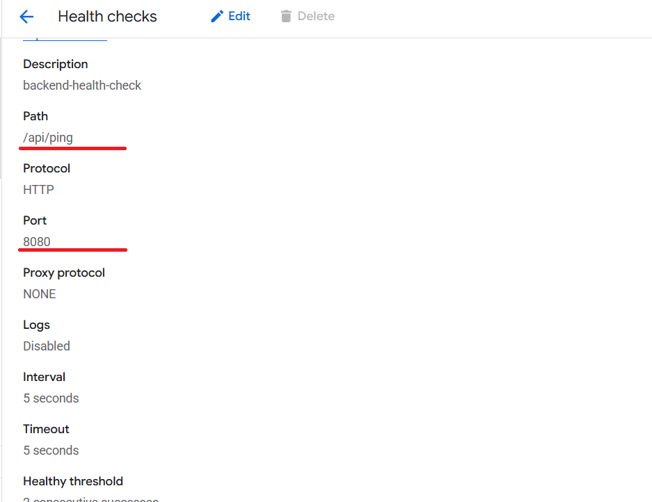

- Frontend Health Check  
  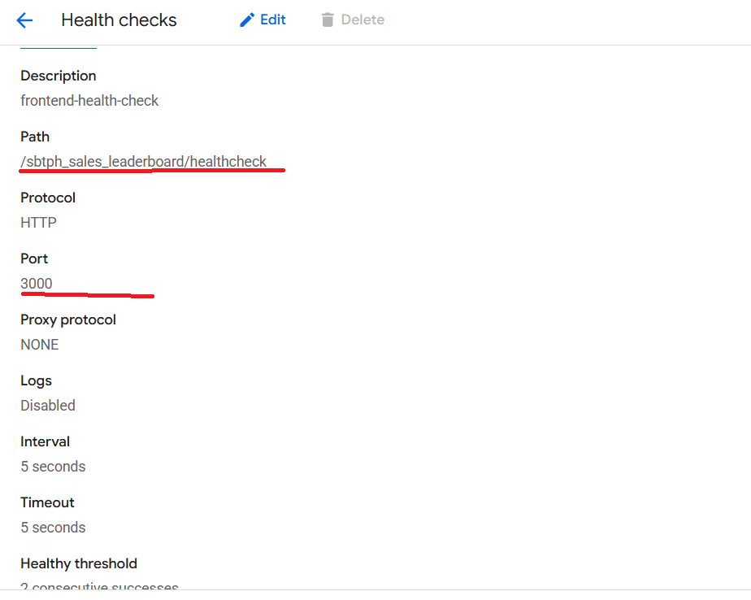

---

### 12. **Create Load Balancer Backend Service for Express (Backend)**

Set up the backend service named `express-service` and configure routing rules in the GCP Load Balancer.

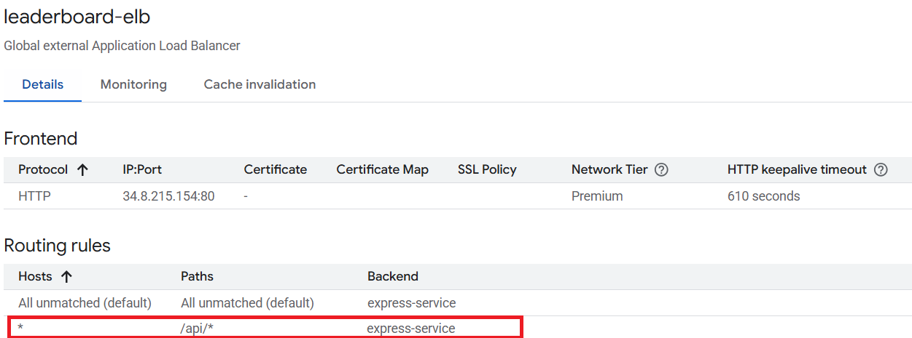


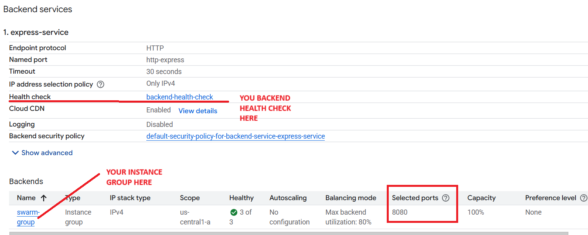
---

### 13. **Test Backend API Using Postman**

- Send a `GET` request:  
  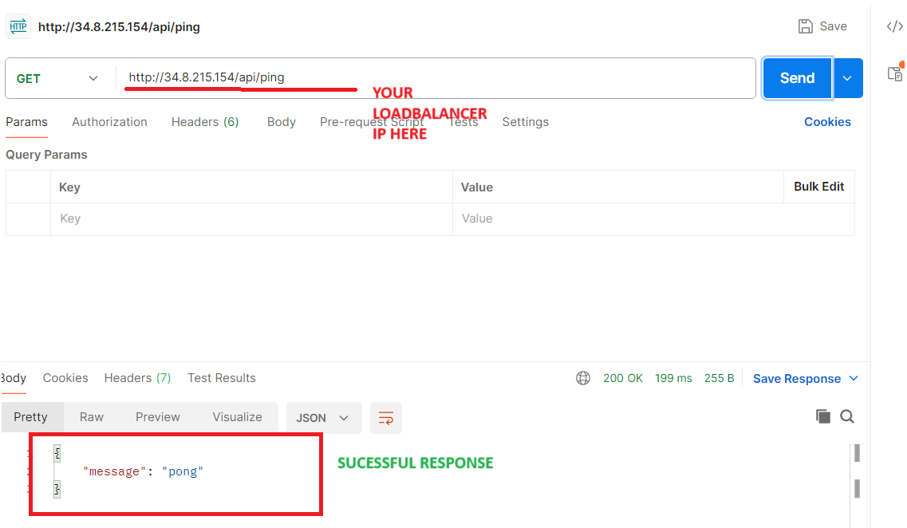

- Send a `POST` request:  
  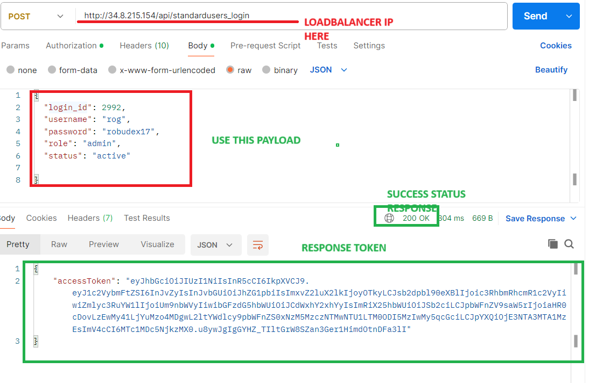

---

### 14. **Build Frontend Docker Image**

Replace the placeholders with your actual Load Balancer IP and port:

```bash
cd frontend/sbtph-sales-leaderboard-app

docker build -t <REPLACE-WITH-YOUR-DOCKERHUB-USERNAME>/leaderboard-frontend \
  --build-arg NUXT_PUBLIC_API_URL=http://<LOADBALANCER-IP>:<PORT>/api \
  --build-arg NUXT_PUBLIC_SOCKET_IO_URL=http://<LOADBALANCER-IP>:<PORT> .


``` 

### 15. Push Frontend Image to Docker Hub

```bash
   docker push <REPLACE-WITH-YOUR-DOCKERHUB-USERNAME>/leaderboard-frontend
```

### 16. Create Frontend Service in Docker Swarm

```bash
docker service create \
  --name leaderboard-frontend \
  --network leaderboard-net \
  --replicas 3 \
  --publish published=3000,target=3000,mode=ingress \
  robudex17/leaderboard-frontend

```

### 17. Update Load Balancer for Nuxt Frontend
Set up a new backend service called nuxt-service, and configure the frontend routing rules.

- Nuxt Backend Service

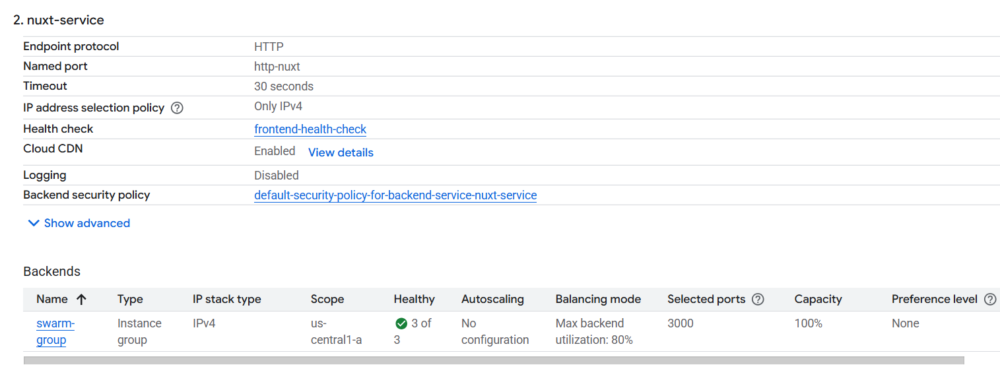

- Frontend Routing Rules

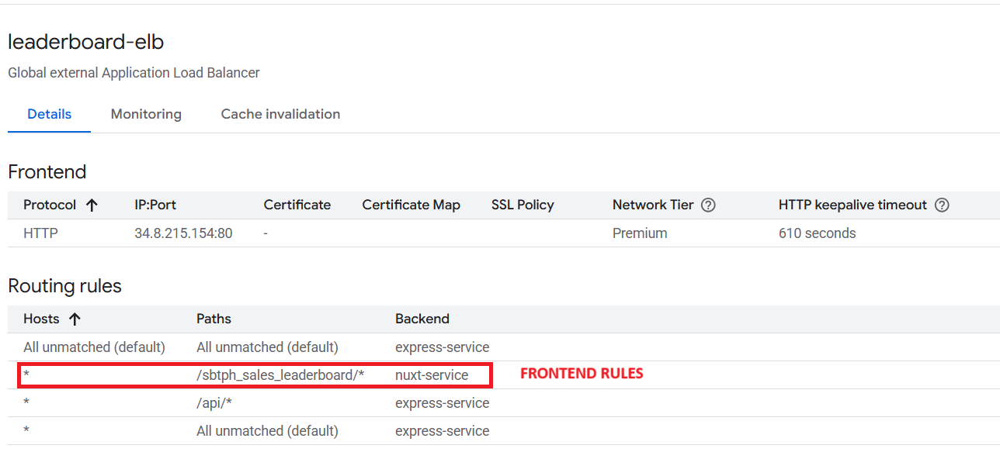


### 18. Test Frontend in the Browser
Open this URL in your browser:

```text
http://<LOADBALANCER-IP>/sbtph_sales_leaderboard/login

```

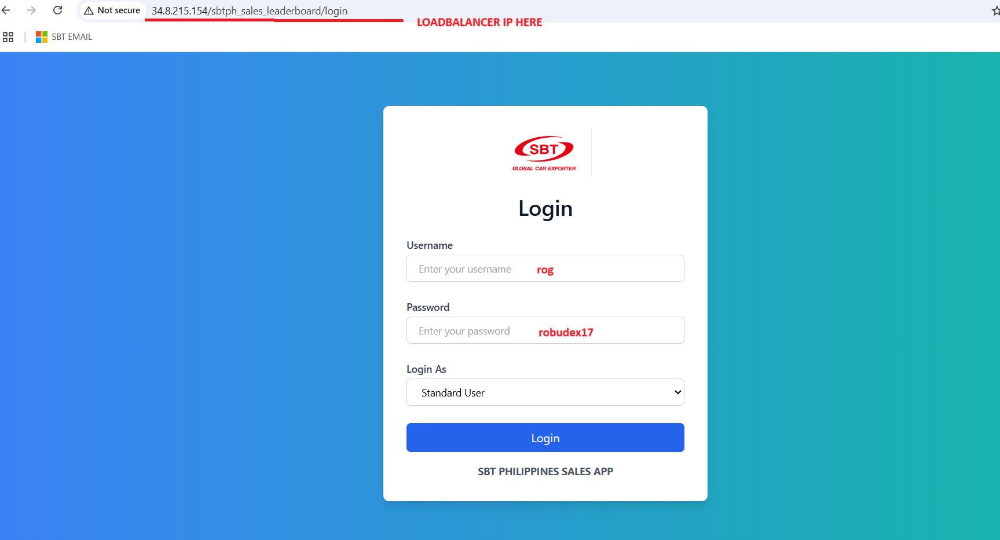


### 19. Log in to the App
Use the following test credentials:

- Username: rog
- Password: robudex17
- Login as: Standard User

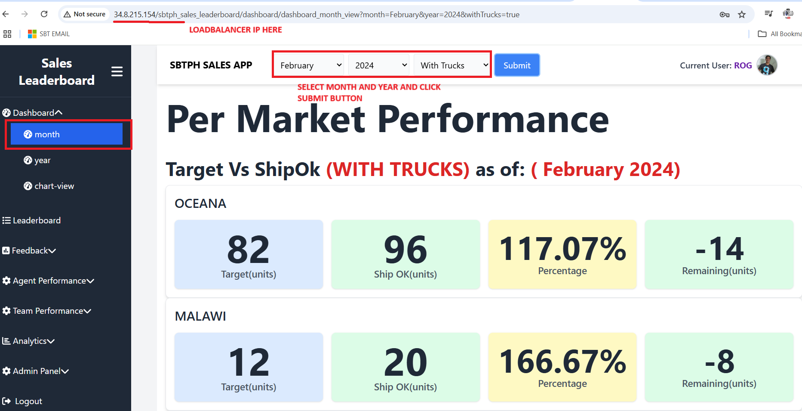

---


### 🔹 Part Two — Deploy Using `docker stack deploy`

1. **Remove Existing Services, Networks, and Images**
```bash
docker service rm leaderboard-frontend leaderboard-backend leaderboard-db
docker network rm leaderboard-net
docker rmi <REPLACE-WITH-YOUR-DOCKERHUB-USERNAME>/leaderboard-frontend <REPLACE-WITH-YOUR-DOCKERHUB-USERNAME>/leaderboard-backend mariadb
```

2. **Navigate to the Directory and Create a `.env` File**

```bash
cd infra/container_orchestration/docker_swarm
touch .env
```

3. **Add Required Variables to `.env`**
(Variables like `MARIADB_ROOT_PASSWORD`, `JWT_SECRET`, `NUXT_PUBLIC_API_URL`, etc.)


🔧 Prepare Docker Compose and Stack YAML Files
⚠️ IMPORTANT: Update Docker Hub Image References

Before building or deploying, you must manually edit the following files:

- docker-compose.yaml

- deploy-stack.yaml

In **both files**, locate the lines like:

```yaml
  image: <DOCKERHUB-USERNAME-HERE>/leaderboard-frontend
  image: <DOCKERHUB-USERNAME-HERE>/leaderboard-backend

```
➡️ Replace <DOCKERHUB-USERNAME-HERE> with your actual Docker Hub username. For example:

```yaml
  image: robudex17/leaderboard-frontend
  image: robudex17/leaderboard-backend
```

❗ If you skip this step, the deployment will fail or pull the wrong image — especially during docker stack deploy.

✅ Do this before proceeding with the following steps:


4. **Build Docker Images Using Compose**\
Make sure you're in the infra/container_orchestration/docker_swarm/ directory:
```bash
docker compose build

```

5. **Push the Images to Docker Hub**

```bash
docker compose push
```

6. **Deploy the Stack Using docker stack deploy**

```bash
export $(cat .env | xargs) && docker stack deploy -c deploy-stack.yaml leaderboard-stack
```

7. **Verify Load Balancer Health and Test Frontend**
Refer to screenshots or instructions above.

---

## ✅ Conclusion

You've successfully deployed a multi-service Docker Swarm setup using GCP instances, Docker Compose, and Docker Stack. This simulates a production-ready container orchestration workflow, complete with persistent volumes, service discovery, scaling, and secure image distribution.

---

