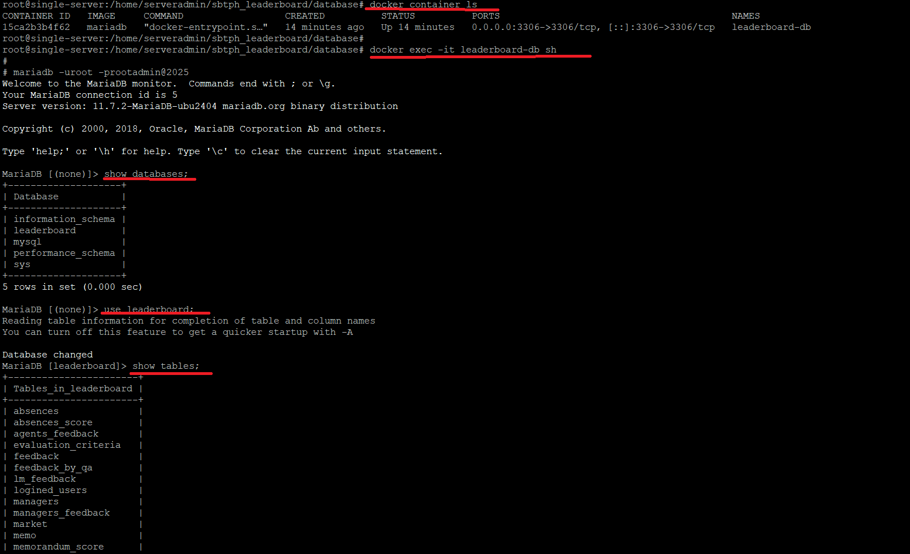
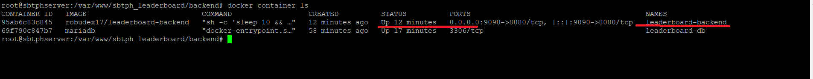
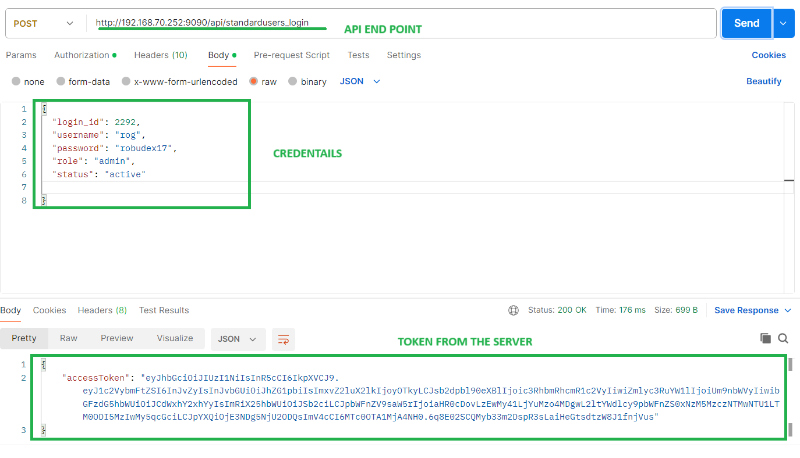
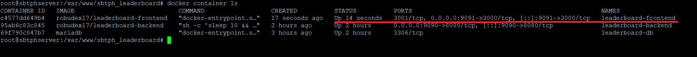

# Project DevOps Journey: From App Creation to On-Premise and Cloud Deployment

## 📦 Phase 2: 🐳 Dockerizing the Application Using Docker

In this phase, we will deploy our applications (frontend, backend, and database) to Docker containers. Although we are still deploying everything to a single server (monolithic in nature), this phase is a critical step in our DevOps journey. By using Docker, we separate our application components into distinct containers, effectively simulating a microservices architecture. This allows us to:

- Use different OS environments per application.
- Install separate dependencies per container.
- Avoid dependency conflicts on the host machine.

### ✅ Benefits of Docker
- Lightweight and fast startup
- Environment consistency
- Simplified deployment and scalability
- Better resource utilization

---

## 🧱 This Phase Has Two Parts:
1. **Deploying Docker containers via command line:**  
   Ideal for learning the fundamentals, but prone to human error.
2. **Deploying Docker containers using `docker-compose`:**  
   Simplifies deployment using a YAML config file.

---

## 🛠️ Prerequisites
1. **Install Docker on the Host Machine (Ubuntu 24.04 LTS):**  
   Follow the official Docker installation guide: https://docs.docker.com/engine/install/ubuntu/

2. **Verify Docker installation:**
   ```bash
   docker version
   ```

3. **Start Docker if not running:**
   ```bash
   sudo systemctl enable docker
   sudo systemctl start docker
   ```
4. Clone the project repository and **cd** to it:
```bash
git clone -b main https://github.com/robudex17/sbtph_leaderboard.git
cd sbtph_leaderboard
```

---

## ⚙️ Part One: Docker Command Line

### 1. Create Docker Network
```bash
docker network create leaderboard-network
```
This creates an isolated network that allows containers to communicate using container names.

---

### 2. Create Docker Volume for Database
```bash
docker volume create leaderboard_db
```
This creates a persistent volume to store database data even if the container stops.

---

### 3. Dockerizing the Application

#### a. 🛢️ Database (MariaDB)
Pull the MariaDB image from Docker Hub:
```bash
docker pull mariadb
```

Run the MariaDB container:
```bash
docker run -d --name leaderboard-db   --network leaderboard-network   -v leaderboard_db:/var/lib/mysql   -v /home/serveradmin/sbtph_leaderboard/database:/docker-entrypoint-initdb.d   -e MARIADB_ROOT_PASSWORD=rootadmin@2025   -e MYSQL_DATABASE=leaderboard   -e MYSQL_USER=admin   -e MYSQL_PASSWORD=admin@2025   -p 3306:3306   mariadb
```

**Explanation:**
- `-d`: Run in detached mode
- `--name`: Assign a container name
- `--network`: Attach to a custom Docker network
- `-v`: Mount volumes for persistent data and DB initialization
- `-e`: Set environment variables for DB setup
- `-p`: Map port 3306 on host to container

**Note:**  
`/home/serveradmin/` is the directory where I cloned the project. Please adjust this path according to your own path.

Verify the container:
```bash
docker container ls
docker exec -it leaderboard-db sh
```

Log into MariaDB:
```bash
mariadb -uroot -prootadmin@2025
show databases;
use leaderboard;
show tables;
```



---

#### b. 🖥️ Backend (Custom Node.js App)
Open the  `Dockerfile` in the `backend` directory:
Here's the content:

```Dockerfile
FROM node:22-alpine

WORKDIR /app

COPY package*.json ./

RUN npm install
RUN npm install -g pm2

COPY . .

EXPOSE 8080

ENTRYPOINT ["sh", "-c", "sleep 10 && exec pm2-runtime start src/server.js --name backend-leaderboard"]
```

Build the Docker image:
```bash
cd backend
docker build -t robudex17/leaderboard-backend .
```

**Explanation:**
- `cd backend`: Change directory to the backend folder containing the Dockerfile and source code.
- `docker build`: Command to build a Docker image from a Dockerfile.
- `-t`: Tag the image with a name (in this case `robudex17/leaderboard-backend`).
- `.`: Use the current directory as the build context for the Docker image.


Run the container:
```bash
docker run --name leaderboard-backend -d   -p 9090:8080   --network=leaderboard-network   -e DB_HOST=leaderboard-db   -e DB_NAME=leaderboard   -e DB_USER=admin   -e DB_PASSWORD=admin@2025   -e JWT_SECRET=<your_jwt_secret>   -e JWT_REFRESH_SECRET=<your_refresh_jwt_secret>   -e PORT=8080   robudex17/leaderboard-backend
```

**Explanation:**
- `docker run`: Run a new container from an image.
- `--name leaderboard-backend`: Assign the container a name (`leaderboard-backend`).
- `-d`: Run the container in detached mode (in the background).
- `-p 9090:8080`: Map port 9090 on the host to port 8080 inside the container.
- `--network=leaderboard-network`: Connect the container to the custom Docker network `leaderboard-network`.
- `-e DB_HOST=leaderboard-db`: Set environment variable `DB_HOST` to `leaderboard-db` (database host).
- `-e DB_NAME=leaderboard`: Set environment variable `DB_NAME` to `leaderboard` (database name).
- `-e DB_USER=admin`: Set environment variable `DB_USER` to `admin` (database user).
- `-e DB_PASSWORD=admin@2025`: Set environment variable `DB_PASSWORD` to `admin@2025` (database password).
- `-e JWT_SECRET=<your_jwt_secret>`: Set environment variable `JWT_SECRET` for JWT authentication secret.
- `-e JWT_REFRESH_SECRET=<your_refresh_jwt_secret>`: Set environment variable `JWT_REFRESH_SECRET` for JWT refresh token secret.
- `-e PORT=8080`: Set environment variable `PORT` to `8080` (port the app listens on inside the container).
- `robudex17/leaderboard-backend`: The Docker image to run the container from.

Verify the backend container.

```bash
   docker container ls 
```




You can use tools like Postman to verify that the backend API is running as expected.




---

#### c. 🌐 Frontend (Nuxt App)
Open  the `Dockerfile` in the `frontend/sbtph-sales-leaderboard-app` directory:
Here's the Content:

```Dockerfile
FROM node:22-alpine

WORKDIR /app

ARG NUXT_PUBLIC_API_URL
ARG NUXT_PUBLIC_SOCKET_IO_URL

COPY package*.json ./

RUN npm install
RUN npm install -g pm2

COPY . .

RUN touch .env
RUN echo "NUXT_PUBLIC_API_URL=${NUXT_PUBLIC_API_URL}" > .env
RUN echo "NUXT_PUBLIC_SOCKET_IO_URL=${NUXT_PUBLIC_SOCKET_IO_URL}" >> .env

RUN npm run build

EXPOSE 3000

CMD ["pm2-runtime", "start", ".output/server/index.mjs", "--name", "frontend-leaderboard"]
```

Build the Docker image:
```bash
cd frontend/sbtph-sales-leaderboard-app
docker build -t robudex17/leaderboard-frontend   --build-arg NUXT_PUBLIC_API_URL=http://192.168.70.252:9090/api   --build-arg NUXT_PUBLIC_SOCKET_IO_URL=http://192.168.70.252:9090 .
```

**Explanation:**
- `docker build`: Build a Docker image from a Dockerfile.
- `-t robudex17/leaderboard-frontend`: Tag the image with the name `robudex17/leaderboard-frontend`.
- `--build-arg NUXT_PUBLIC_API_URL=http://192.168.70.252:9090/api`: Pass build argument `NUXT_PUBLIC_API_URL` to the Docker build process, used to configure the frontend API URL.  
  > **Note:** `192.168.70.252` is my own IP address. Please change it according to your own server IP.
- `--build-arg NUXT_PUBLIC_SOCKET_IO_URL=http://192.168.70.252:9090`: Pass build argument `NUXT_PUBLIC_SOCKET_IO_URL` to configure the Socket.IO URL during the build.  
  > **Note:** `192.168.70.252` is my own IP address. Please change it according to your own server IP.
- `.`: Use the current directory as the build context (where the Dockerfile is located).


Run the container:
```bash
docker run --name leaderboard-frontend -d   -p 9091:3000   --network=leaderboard-network   -e NUXT_PUBLIC_API_URL=http://192.168.70.252:9090/api   -e NUXT_PUBLIC_SOCKET_IO_URL=http://192.168.70.252:9090   robudex17/leaderboard-frontend
```
**Explanation:**
- `docker run`: Run a new container from an image.
- `--name leaderboard-frontend`: Assign the container the name `leaderboard-frontend`.
- `-d`: Run the container in detached mode (in the background).
- `-p 9091:3000`: Map port 9091 on the host to port 3000 in the container.
- `--network=leaderboard-network`: Connect the container to the Docker network `leaderboard-network`.
- `-e NUXT_PUBLIC_API_URL=http://192.168.70.252:9090/api`: Set the environment variable `NUXT_PUBLIC_API_URL` to the backend API URL.  
  **Note:** Replace `192.168.70.252` with your own IP address.
- `-e NUXT_PUBLIC_SOCKET_IO_URL=http://192.168.70.252:9090`: Set the environment variable `NUXT_PUBLIC_SOCKET_IO_URL` to the backend socket URL.  
  **Note:** Replace `192.168.70.252` with your own IP address.
- `robudex17/leaderboard-frontend`: The Docker image to create the container from.


Verify the backend container.

```bash
   docker container ls 
```




---

### ✅ Final Step: Test the App

Access the application from your browser:
```
http://<YOUR_SERVER_IP>:9091/sbtph_sales_leaderboard/login
# Example:
http://192.168.70.252:9091/sbtph_sales_leaderboard/login
```

Login credentials:
```bash
username: rog
password: robudex17
login as: Standard User
```

---


## ⚙️ Part Two: Docker Compose.
